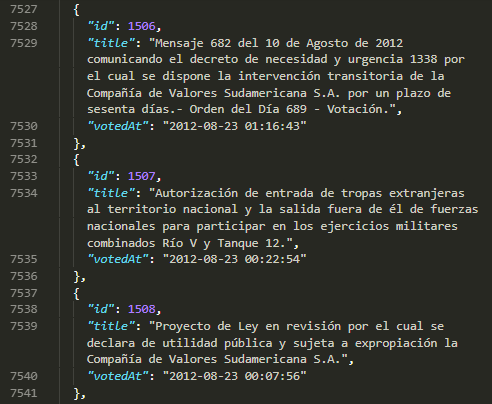
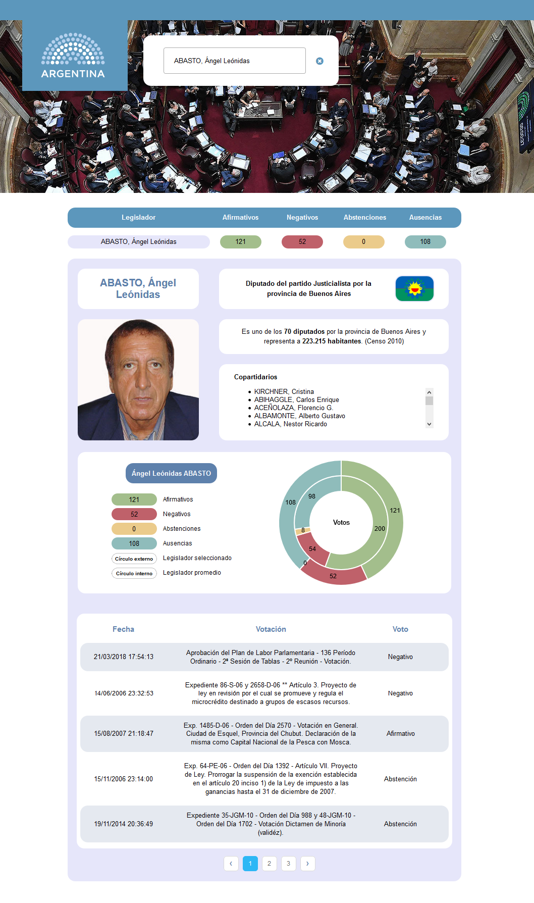

# legistats

  

Quick project in TypeScript/React for viewing legislative records.

Data source: https://github.com/nahuelhds/votaciones-ar-datasets/

    
    &nbsp;&nbsp;&nbsp;&nbsp;
    

## Overview

Frontend-only web app for viewing the voting records of 1648 Argentine legislators, along with information on their parties, party colleagues, constituencies, flags, and vote details.

    

Features:

- Statically typed CRA app
- Search box with autosuggestion
- Instant table filtering
- Doughnut chart for vote numbers
- Paginated table for vote details
- Data stored as JSON
- Loading indicators

## Data

Since this is a frontend-only project, data is simply stored as JSON, with two exceptions:

1. As photographs are no longer available at the original API, they are generated via [Faker.js](https://github.com/marak/Faker.js/) (Two photographs are still included for demo purposes.)
2. As the link table for votes is too large for efficient JSON parsing, vote numbers are randomly generated, so vote details are randomly assigned. The votes data, however, is still provided as an `.sql` file in the `data` directory.

    

## Installation

1. Install [Node](https://nodejs.org/en/download/) and clone repo
2. Get dependencies: `npm install`
3. Run server and client: `npm run start`

## Operation

Simply look up a legislator in the search box, or click on a name in the table, to view all their available information.

    

## Author

© 2019 Iván Ovejero

## License

Distributed under the MIT License. See [LICENSE.md](LICENSE.md)
